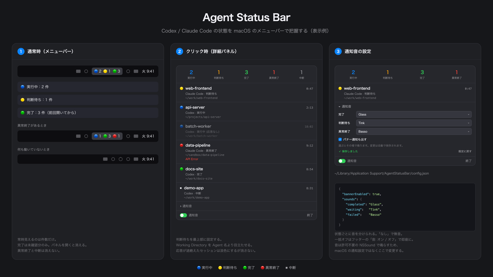

# Agent Status Bar

[](LICENSE)
[](#動作環境)

> Codex / Claude Code の状態を macOS のメニューバーから一目で把握する、軽量なステータスモニター。



Coding Agent を複数並列で動かしていると、こうなります。

- どれがまだ動いているのか分からない
- どれが自分の承認を待っているのか分からない
- 終わったことに気づかない
- 通知が来ても「どのディレクトリの作業が終わったのか」が分からない
- Codex と Claude Code を別々に見に行く必要がある
- SSH 先（リモート）で動かした Agent は手元から見えない

Agent Status Bar は、**Agent を操作するためのアプリではありません。**
「今どれが動いていて、どれが自分待ちで、どれが終わったのか」を数秒で把握するためだけのものです。

---

## できること

- **ターン途中から分かる** — ログの更新を待たず、hook 経由で実行中・判断待ち・完了をリアルタイムに反映します
- **横断的に見る** — Codex と Claude Code のセッションが、provider を問わず1か所に並びます
- **リモートも見る** — SSH 先で動く Agent も、トンネル経由でまとめて並べられます（🌐 付き）。ホストを選ぶだけで、接続も hook の設定も自動で行います
- **どの作業か分かる** — Agent 名よりディレクトリ名を目立たせています。「Codex が完了」ではなく「`api-server` が完了」
- **音で気づく** — 完了・判断待ち・異常終了で別々の音を鳴らせます
- **死んだセッションを検出する** — 終了イベントを出さずに消えたセッションも、プロセスの生存確認で検出します
- **会話を読まない** — プロンプト・コマンド・応答内容を保持できないデータ構造にしています
- **事前設定が要らない** — セッションを登録する仕組みはありません。動かした Agent が勝手に並びます

---

## ログではなく、hook で状態を受け取ります

Agent Status Bar は、セッションログを定期的に読み取って状態を推測するのではなく、
Codex / Claude Code が発行する hook イベントを直接受け取ります。

そのため、ターンが終わるのを待たずに、実行開始・ツール実行・判断待ち・完了を反映できます。
特に Codex はセッションログへの書き込みがターン完了時にまとまることがありますが、
Agent Status Bar は hook を使うため、応答中の状態も追跡できます。

また、プロセスの生存確認も併用しています。
終了イベントが届かないままターミナルが閉じられた場合も、
完了とは区別して「中断」と表示します。

---

## 状態

| 表示 | 意味 |
|---|---|
| 🔵 実行中 | 処理を実行している |
| 🟡 判断待ち | 承認・入力を待っている（**あなたの番**） |
| 🟢 完了 | ターンが完了した |
| 🔴 異常終了 | エラーで終わった |
| ⏹ 中断 | 終了イベントを出さずにプロセスが消えた（ターミナルを閉じた等） |

メニューバーには件数だけが出ます。0 件の状態は表示しません。

**🟢 完了は「前回パネルを開いてから完了した件数」です。** 完了したセッションは記録として最大24時間残るため、総数を出すと一日中大きな数字が居座り、一目で分かるという価値が失われます。パネルを開くとリセットされます。

異常終了はパネルを開いても消えません（見ただけでは解決しないため）。

---

## 動作環境

- **macOS 14 以降**
- **[Codex CLI](https://github.com/openai/codex) / [Claude Code](https://github.com/anthropics/claude-code)** のいずれか、または両方
- **Node.js** — hook を登録するスクリプトの実行にのみ使います
- **Xcode** — **ソースからビルドする場合のみ**必要です（Command Line Tools だけでは足りません）

## セットアップ

### 1. アプリを入れる

#### 方法 A: ダウンロードして使う（ビルド不要）

1. [Releases](https://github.com/koki-nagatani/agent-status-bar/releases/latest) から `AgentStatusBar.app.zip` をダウンロードして展開する
2. `AgentStatusBar.app` を `/Applications` へ移動する
3. **署名していない配布物なので、初回だけ隔離属性を外します**

   ```bash
   xattr -dr com.apple.quarantine /Applications/AgentStatusBar.app
   ```

   （または Finder で右クリック → 「開く」→ 確認ダイアログで「開く」）
4. 起動する。メニューバーに常駐します（Dock にアイコンは出ません）

> [!NOTE]
> ローカルビルドと同じ ad-hoc 署名のため、macOS はバナー通知を出しません（音は鳴ります）。
> 詳細は [うまく動かないとき](#バナー通知が出ない) を参照してください。

#### 方法 B: ソースからビルド

```bash
./Scripts/install.sh
```

`/Applications/AgentStatusBar.app` に配置して起動します。

> [!NOTE]
> 「ログイン時に起動」は登録した時点のアプリの場所を記憶します。
> `build/` はビルドごとに作り直されるため、そこから起動したままにせず
> `install.sh` で固定の場所へ入れてください。

### 2. hook を登録

Agent の状態は hook 経由で受け取ります。**Node.js が必要です。**

```bash
# ソースからビルドした場合（repo 内で）
node Scripts/setup-hooks.js

# ダウンロード版（スクリプトはアプリに同梱しています）
node "/Applications/AgentStatusBar.app/Contents/Resources/setup-hooks.js"
```

`~/.claude/settings.json` と `~/.codex/hooks.json` に登録します。
**あなたが既に登録している hook は変更しません。** 同じイベントに独立したエントリとして追加するだけです。

Claude Code は設定を動的に読み直すので、再起動は不要です。

### 3. Codex は承認が必要

**Codex は `hooks.json` に書くだけでは hook を実行しません。** エントリごとに信頼の承認が必要です。

ターミナルで Codex を起動し、hook の信頼を求められたら承認してください。

```bash
codex
```

> [!IMPORTANT]
> 承認プロンプトは Codex の**ターミナル UI にのみ**表示されます。
> VSCode の統合ターミナルから起動すれば承認できますが、
> VSCode に紐づいたチャット UI からは承認できません。
>
> 承認できたかどうかは、Codex のセッションが Agent Status Bar に現れるかで判断してください。
> 設定ファイルからは判定できません（承認の記録はコマンド内容のハッシュを含むため）。
>
> **すでに起動している Codex セッションには反映されません。** Codex は起動時に設定を読むため、
> 承認後に新しくセッションを開いてください。

### 外したいとき

```bash
node Scripts/setup-hooks.js --uninstall   # hook を外す
node Scripts/setup-hooks.js --status      # 登録状態を確認する
```

ダウンロード版は、同じスクリプトが同梱されています。

```bash
node "/Applications/AgentStatusBar.app/Contents/Resources/setup-hooks.js" --status
```

> [!TIP]
> Claude Code が動いている間に外すと、設定がメモリから書き戻されて復活することがあります。
> 確実に外すには、Claude Code を終了してから実行してください。

---

## リモート（SSH 越しの Agent を見る）

別のマシンや SSH 先で動く Codex / Claude Code も、同じメニューバーに並べられます。

パネルの **リモート** を開くと、`~/.ssh/config` の Host が一覧に出ます。
監視したいホストをオンにすると、次のことが**自動で**行われます。

1. SSH のリバーストンネル（`ssh -R`）でリモートとローカルをつなぐ
2. リモートに hook の shim を配置する
3. リモートの Claude Code / Codex に hook を登録する

あとはリモートで Agent を動かすだけで、ローカルのメニューバーに **🌐 ホスト名付き**で並びます。

- 各ホストの行に接続状態（接続中／接続済／失敗）が出ます
- オフにすると、リモートの hook 登録を解除し、トンネルを畳みます

> [!NOTE]
> **鍵認証（ssh-agent）が前提です。** パスワードや 2FA が必要なホストには自動接続できません。
> 対象は `~/.ssh/config` に定義され、`ssh <host>` で入れるホストです。

> [!IMPORTANT]
> **Codex はリモートでも hook の信頼承認が必要です。** リモートで `codex` を起動して承認してください。
> Claude Code は設定を動的に読み直すため、追加の操作は要りません。

### 仕組み

hook は同じマシンの Unix ドメインソケット経由でアプリに届きます。
リモートの hook を届けるために、`ssh -R` でリモートの Unix ソケットを
ローカルのアプリのソケットへ転送します。TCP ポートを開かず、追加のデーモンも要りません。

リモートのセッションはローカルの PID を持たないため、プロセスの生存確認は行わず、
終了イベントと無通信タイムアウトだけで判定します。

---

## 設定

パネル下部の **設定** を開くと変更できます。

- **状態ごとの通知音** — 選んだ瞬間に鳴るので、決めてから確認しに行く必要はありません
- **バナー通知** — 音とは独立に切れます
- **ログイン時に起動**

音を一括で止めたいときは、フッターの **通知音スイッチ** をオフにします。
個別の音設定は保持されるので、戻せば元通りです。会議中などに使ってください。

### 設定ファイル

`~/Library/Application Support/AgentStatusBar/config.json` に保存されます。

```json
{
  "muted": false,
  "bannerEnabled": true,
  "sounds": {
    "completed": "Glass",
    "waiting": "Blow",
    "failed": "Basso"
  }
}
```

- 編集すると**次の通知から反映されます**（再起動不要）
- `"none"` で無音になります
- 一部のキーだけ書けば、残りは既定値が使われます
- 音の名前は `/System/Library/Sounds/` のファイル名です。`~/Library/Sounds/` に置いた自作の aiff も使えます

「ログイン時に起動」は macOS 側が状態を持つため、この設定ファイルには含まれません。

---

## 会話内容は読み取りません

hook が渡してくる payload には、**あなたのプロンプト全文・実行コマンド全文・Agent の応答全文が含まれます。**

Agent Status Bar はこれらを一切保持しません。読み取るのは以下だけです。

| 読み取るもの | 用途 |
|---|---|
| セッション ID | セッションの識別 |
| 作業ディレクトリ | 一覧に表示する |
| イベント名 | 状態の判定 |
| ホスト名（リモートのみ） | どのリモートのセッションかを表示する（あなたが選んだ `~/.ssh/config` の Host 名） |

会話内容はディスクにもログにも残りません。
これは運用上の努力目標ではなく、**アプリ内部でイベントを表す型が会話内容を保持できない構造**にすることで担保しています。

---

## うまく動かないとき

### 何も表示されない

```bash
node Scripts/setup-hooks.js --status
```

hook が登録されていること、そして**アプリが起動していること**を確認してください。
アプリが起動していない間、hook は何もしません。

### Codex だけ表示されない

信頼の承認が済んでいないか、承認前に開いたセッションを見ている可能性が高いです。
[3. Codex は承認が必要](#3-codex-は承認が必要) を確認してください。

### 判断待ちが一度も出ない

承認を自動化していると、Agent が承認を求めないため 🟡 は発生しません。
Claude Code を auto モードで使っている場合などが該当します。

### バナー通知が出ない

**ローカルでビルドしたアプリは macOS の通知システムに登録されないため、バナーは出ません。**
音は許可を必要としない仕組みで鳴らしているので、こちらは動きます。

音は macOS の通知設定の管轄外なので、変更はこのアプリ内の設定から行ってください。

---

## 制限

- **同一ユーザーのセッションが対象です。** リモート（SSH 越し）のホストも見られますが、鍵認証（ssh-agent）が前提で、`~/.ssh/config` に定義されたホストに限ります
- **マウスオーバーでのプレビューはありません。** メニューバーにマウスを載せたときの表示は macOS の API で取得できないためです
- 状態は永続化されません。アプリを再起動すると空から始まります
- セッションを一覧から手動で消す手段はまだありません
- UI の文言は日本語のみです

---

## License

[Apache License 2.0](LICENSE)

外部ライブラリには依存していません（macOS の標準フレームワークのみ）。
